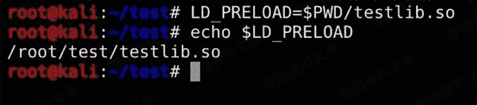
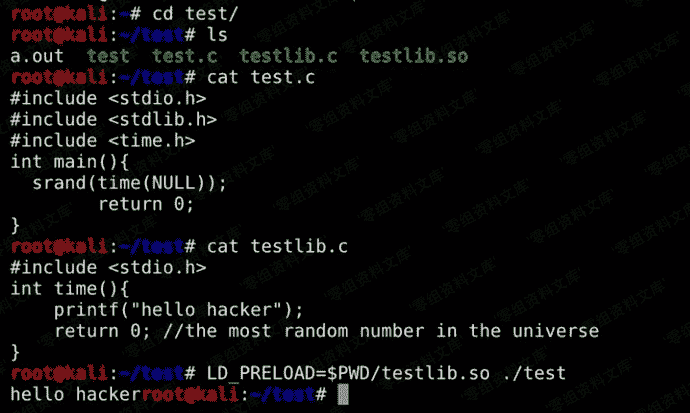
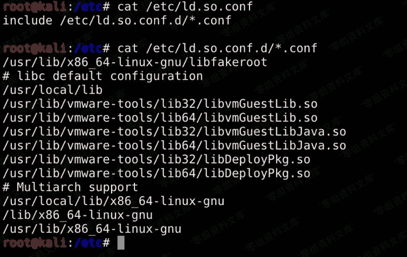

# 动态链接库后门

> 原文：[https://www.zhihuifly.com/t/topic/3506](https://www.zhihuifly.com/t/topic/3506)

## 动态链接库后门

linux操作系统的动态链接库在加载过程中，动态链接器会先读取LDPRELOAD环境变量和默认配置文件/etc/ld.so.preload，并将读取到的动态链接库文件进行预加载，即使程序不依赖这些动态链接库，LDPRELOAD环境变量和/etc/ld.so.preload配置文件中指定的动态链接库依然会被装载，这样就导致了动态链接库文件可以被当做后门使用。

**LD_PRELOAD**

这里创建了一个test.c文件，其中调用time方法、然后创建了一个testlib.c、其中生成了一个time方法供test调用 编译后用LD_PRELOAD=$PWD/testlib.so ./test劫持了time。

```
//test.c
#include <stdio.h>
#include <stdlib.h>
#include <time.h>
int main(){
  srand(time(NULL));
        return 0;
}
//编译：gcc -o test test.c 
```

```
//testlib.c
#include <stdio.h>
int time(){
    printf("hello hacker");
    return 0; //the most random number in the universe
}
//编译：gcc -shared -fPIC testlib.c -o test.so 
```





**ld.so.preload**

同理，修改/etc/ld.so.conf.d/下的conf文件也可以达到劫持的目的。

