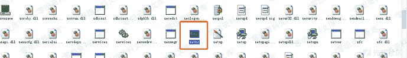
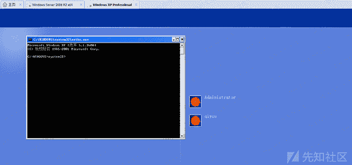

# shift后门

> 原文：[https://www.zhihuifly.com/t/topic/3509](https://www.zhihuifly.com/t/topic/3509)

## shift后门

这个是比较老的方式了，这里简单讲一下，在windows中有一些辅助功能，能在用户未登录系统之前可以通过组合键来启动它，类似的辅助功能有：

1.  `C:\Windows\System32\sethc.exe` 粘滞键，启动快捷键：按五次shift键
2.  `C:\Windows\System32\utilman.exe` 设置中心，启动快捷键：Windows+U键

在低版本的windows中，我们可以直接把`setch.exe`替换成我们的后门程序，下面我们把`setch.exe`替换为`cmd.exe`

