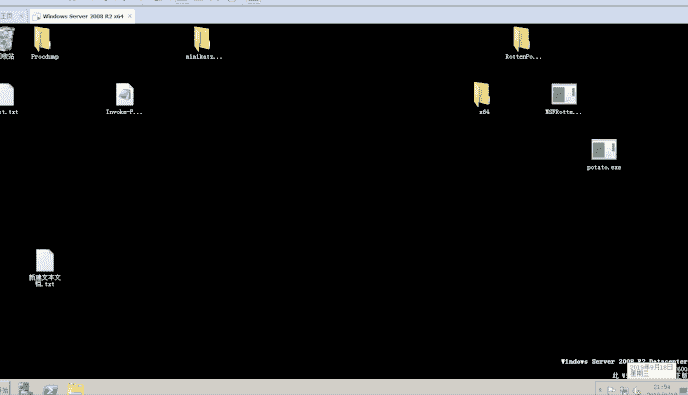
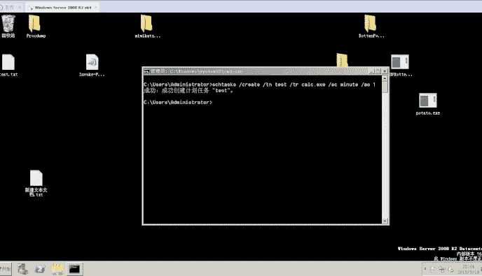

# 定时任务

> 原文：[https://www.zhihuifly.com/t/topic/3512](https://www.zhihuifly.com/t/topic/3512)

## 定时任务

windows下定时任务的命令有两个分别是：`at`和`schtasks`，他们两者主要区别是`at`命令在`win7`、`08`等高版本的windows中是不能将任务在前台执行的，也就是只会打开一个后台进程，而`schtasks`是将定时的任务在前台执行，下面我们逐个看看

`at`的一些参数

```
AT [\\computername] time [/INTERACTIVE]
    [ /EVERY:date[,...] | /NEXT:date[,...]] "command" 
```

`at`的执行如下：



`schtasks`一些参数：

```
schtasks /create /tn TaskName /tr TaskRun /sc schedule [/mo modifier] [/d day] [/m month[,month...] [/i IdleTime] [/st StartTime] [/sd StartDate] [/ed EndDate] [/s computer [/u [domain\]user /p password]] [/ru {[Domain\]User | "System"} [/rp Password]] /? 
```

`schtasks`的执行如下：

