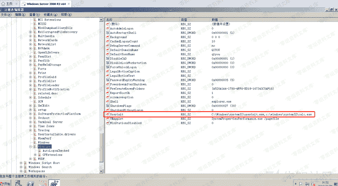
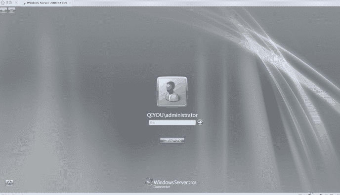

# 用户登陆初始化

> 原文：[https://www.zhihuifly.com/t/topic/3513](https://www.zhihuifly.com/t/topic/3513)

## 用户登陆初始化

`Userinit`的作用是用户在进行登陆初始化设置时，`WinLogon`进程会执行指定的`login scripts`，所以我们可以修改它的键值来添加我们要执行的程序

注册表路径为：`HKLM\SOFTWARE\Microsoft\Windows NT\CurrentVersion\Winlogon\Userinit`，我们添加一个我们启动的程序，多个程序用逗号隔开

效果如下：

