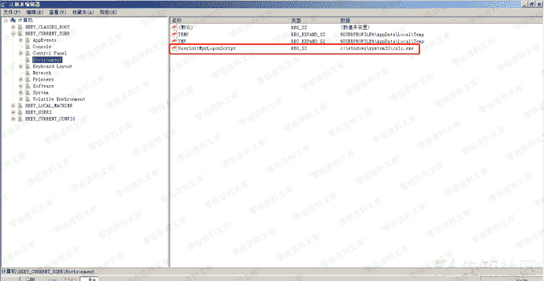
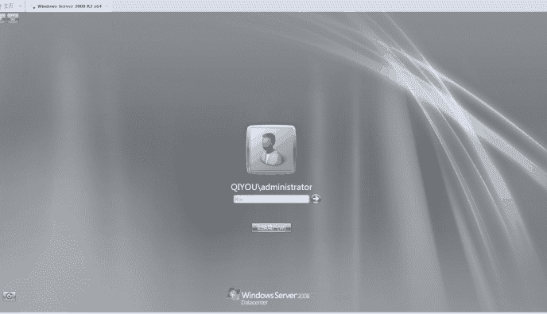

# Logon Scripts

> 原文：[https://www.zhihuifly.com/t/topic/3514](https://www.zhihuifly.com/t/topic/3514)

## Logon Scripts

`Logon Scripts`优先于av先执行，我们可以利用这一点来绕过av的敏感操作拦截

注册表路径为：`HKEY_CURRENT_USER\Environment`，创建一个键为：`UserInitMprLogonScript`，其键值为我们要启动的程序路径

效果如下：

