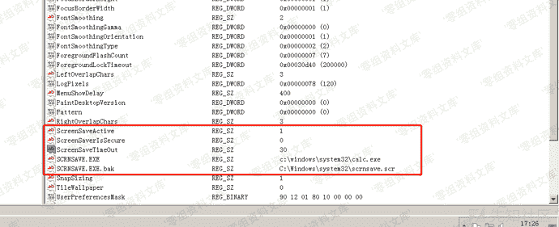
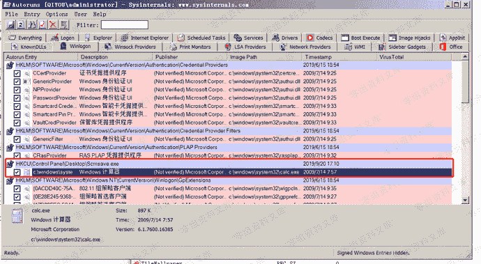

# 屏幕保护程序

> 原文：[https://www.zhihuifly.com/t/topic/3515](https://www.zhihuifly.com/t/topic/3515)

## 屏幕保护程序

在对方开启屏幕保护的情况下，我们可以修改屏保程序为我们的恶意程序从而达到后门持久化的目的
其中屏幕保护的配置存储在注册表中，其位置为：`HKEY_CURRENT_USER\Control Panel\Desktop`，关键键值如下：

1.  `SCRNSAVE.EXE` - 默认屏幕保护程序，我们可以把这个键值改为我们的恶意程序
2.  `ScreenSaveActive` - 1表示屏幕保护是启动状态，0表示表示屏幕保护是关闭状态
3.  `ScreenSaverTimeout` - 指定屏幕保护程序启动前系统的空闲事件，单位为秒，默认为900（15分钟）

设置如下：

效果图：

