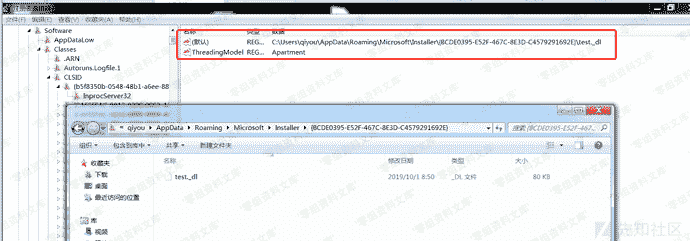
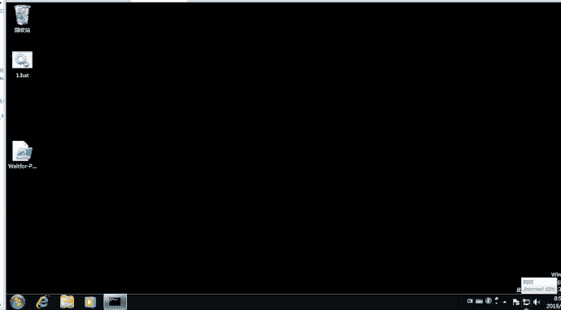

# Hijack CAccPropServicesClass and MMDeviceEnumerator

> 原文：[https://www.zhihuifly.com/t/topic/3520](https://www.zhihuifly.com/t/topic/3520)

## Hijack CAccPropServicesClass and MMDeviceEnumerator

什么是`COM`（来自`WIKI`）

```
组件对象模型（英语：Component Object Model，缩写COM）是微软的一套软件组件的二进制接口标准。这使得跨编程语言的进程间通信、动态对象创建成为可能。COM是多项微软技术与框架的基础，包括OLE、OLE自动化、ActiveX、COM+、DCOM、Windows shell、DirectX、Windows Runtime。 
```

这个和`CRL`劫持`.NET`程序类似，也是通过修改`CLSID`下的注册表键值，实现对`CAccPropServicesClass`和`MMDeviceEnumerator`的劫持，而系统很多正常程序启动时需要调用这两个实例，所以这个很适合我们的后门持久化。

经测试貌似64位系统下不行（或许是我姿势的问题），但是32位系统下可以，下面说一下32位系统利用方法：

在`%APPDATA%\Microsoft\Installer\{BCDE0395-E52F-467C-8E3D-C4579291692E}\`下放入我们的后门`dll`，重命名为`test._dl`

PS：如果`Installer`文件夹不存在，则依次创建`Installer\{BCDE0395-E52F-467C-8E3D-C4579291692E}`


然后就是修改注册表了，在注册表位置为：`HKCU\Software\Classes\CLSID\`下创建项`{b5f8350b-0548-48b1-a6ee-88bd00b4a5e7}`，然后再创建一个子项`InprocServer32`，默认为我们的`dll`文件路径：`C:\Users\qiyou\AppData\Roaming\Microsoft\Installer\{BCDE0395-E52F-467C-8E3D-C4579291692E}`，再创建一个键`ThreadingModel`，其键值为：`Apartment`



然后就是测试了，打开`iexplore.exe`，成功弹框



PS：`{b5f8350b-0548-48b1-a6ee-88bd00b4a5e7}`对应`CAccPropServicesClass`，`{BCDE0395-E52F-467C-8E3D-C4579291692E}`对应`MMDeviceEnumerator`