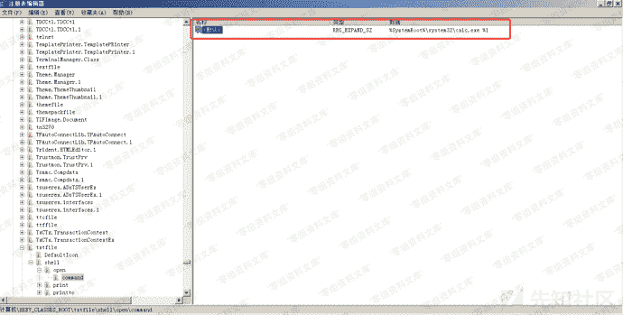
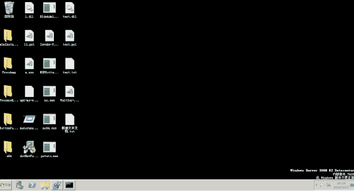

# 文件关联

> 原文：[https://www.zhihuifly.com/t/topic/3522](https://www.zhihuifly.com/t/topic/3522)

## 文件关联

什么是文件关联

```
文件关联就是将一种类型的文件与一个可以打开它的程序建立起一种依存关系。一个文件可以与多个应用程序发生关联。可以利用文件的“打开方式”进行关联选择。
举个例子来说，位图文件（BMP文件）在Windows中的默认关联程序是“图片”，如果将其默认关联改为用ACDSee程序来打开，那么ACDSee就成了它的默认关联程序。
PS：来自百度百科 
```

我们可以用`assoc`命令显示或修改文件扩展名关联，我们可以看一下`.txt`文件的关联


我们可以用`ftype`命令显示或修改用在文件扩展名关联中的文件类型


相关注册表

```
HKEY_CURRENT_USER\Software\Classe    //保存了当前用户的类注册和文件扩展名信息
HKEY_LOCAL_MACHINE\Software\Classe   //保存了系统所有用户用户的类注册和文件扩展名信息
HKEY_CLASS_ROOT                      //HKEY_CLASSES_ROOT项提供合并来自上面两个的信息的注册表的视图 
```

我们以`.txt`为例，通过文件关联来修改它默认打开的程序。
修改`\HKEY_CLASS_ROOT\txtfile\shell\open\command`的默认值为我们要执行的程序



效果如下：

