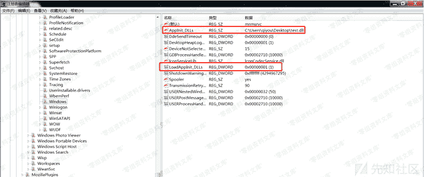
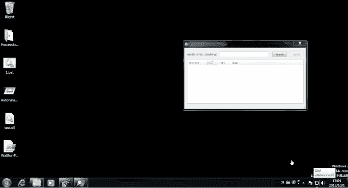

# AppInit_DLLs

> 原文：[https://www.zhihuifly.com/t/topic/3523](https://www.zhihuifly.com/t/topic/3523)

## AppInit_DLLs

`User32.dll`被加载到进程时，会读取`AppInit_DLLs`注册表项，如果有值，调用`LoadLibrary() api`加载用户dll。

其注册表位置为：`HKEY_LOCAL_MACHINE\SOFTWARE\Microsoft\Windows NT\CurrentVersion\Windows\AppInit_DLLs`，把`AppInit_DLLs`的键值设置为我们dll路径，将`LoadAppInit_DLLs`设置为1

效果如下：

