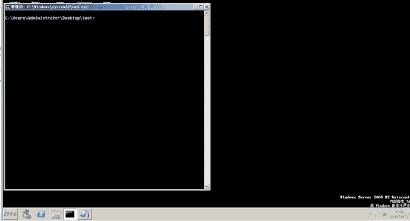
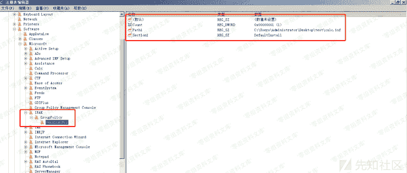
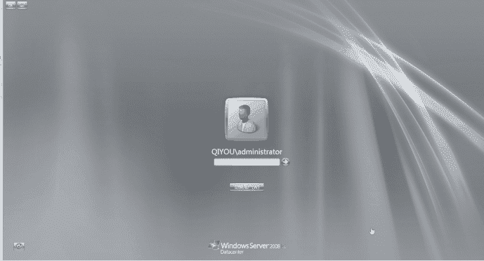

# 利用inf文件实现后门

> 原文：[https://www.zhihuifly.com/t/topic/3526](https://www.zhihuifly.com/t/topic/3526)

## 利用inf文件实现后门

`inf`文件

```
INF文件或安装信息文件是Microsoft Windows用于安装软件和驱动程序的纯文本文件。INF文件最常用于安装硬件组件的设备驱动程序。Windows包含用于创建基于INF的安装的IExpress工具。INF文件是Windows安装程序API及其后续版本Windows Installer的一部分。
PS：来自WIKI
inf`文件的结构
想了解更多可以看一下微软的手册：`https://docs.microsoft.com/en-us/previous-versions/windows/it-pro/windows-2000-server/cc939869(v=technet.10)#information-inf-file-entries
1\. DefaultInstall节（来自WIKI）
INF文件的结构与INI文件的结构非常类似; 它包含用于指定要复制的文件，对注册表的更改等的各个部分。所有INF文件都包含一个[Version]带有Signature 键值对的部分，用于指定INF文件所针对的Windows版本。签名通常是$CHICAGO$（对于Windows 9x）或$WINDOWS NT$（对于Windows NT / 2K / XP）。其余大多数部分是用户定义的，并且包含特定于要安装的组件的信息。 
3.  `DefaultInstall节（来自微软的手册）

    RunPreSetupCommands-本节中指定的命令在安装服务配置文件之前运行。

    RunPostSetupCommands-本节中指定的命令在安装程序完成服务配置文件后运行。

    RunPreUnInstCommands-本节中指定的命令在卸载程序开始之前运行。

    RunPostUnInstCommands-本节中指定的命令在卸载程序运行后运行。` 

```

下面举一个`calc.inf`弹计算器的例子

```
[Version]
Signature="$CHICAGO$"
AdvancedINF=2.5,"test"
[DefaultInstall]
RunPreSetupCommands=Command1
[Command1]
C:\windows\system32\calc.exe 
```

命令行下执行：

```
rundll32.exe advpack.dll,LaunchINFSection calc.inf,DefaultInstall 
```

效果如下：



后门实现：
在注册表`HKEY_CURRENT_USER\Software\Microsoft\`处依次新建子项`\IEAK\GroupPolicy\PendingGPOs`，然后再新建几个键，如下：

1.  键：`Count`，类型：`REG_DWORD`，键值：`1`
2.  键：`Path1`，类型：`REG_SZ`，键值：`C:\Users\Administrator\Desktop\test\calc.inf` //这个为我们inf文件的路径，这里以上面那个inf文件例子为例
3.  键：`Section1`，类型：`REG_SZ`，键值：`DefaultInstall`

如下图所示：



重启电脑之后成功弹出计算器



但是重启之后`PendingGPOs`该项就会被清除，需要我们重新修改注册表

