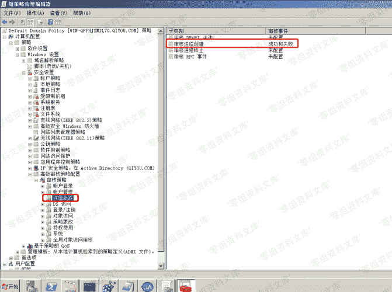
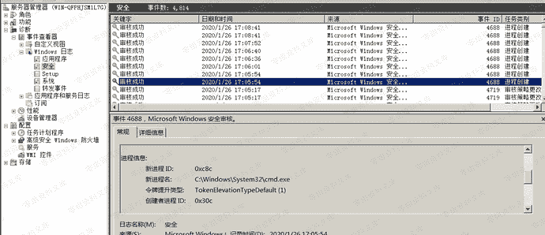
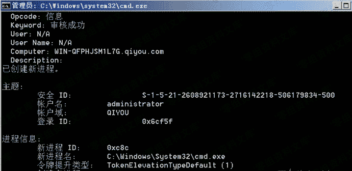

# Audit Process Creation (592/4688)

> 原文：[https://www.zhihuifly.com/t/topic/3600](https://www.zhihuifly.com/t/topic/3600)

### Audit Process Creation (592/4688)

在启用了"审核进程创建"时记录4688的情况下（系统默认是关闭的，需要手动开启），`Windows 7`、`Windows Server 2008`及以上版本，会在每次创建一个进程时会把事件以`Event ID`为`4688`记录到windows安全日志中

**注**：`Windows XP/2003`的`Event ID`为`592`

开启：`Edit Default Domain Policy -> Policy location: Computer Configuration -> Policies -> Windows Settings -> Security Settings -> Advanced Audit Configuration -> Detailed Tracking`

策略名称: `Audit Process Creation`



查看ID为`4688`的安全事件：



命令行获取：

```
wevtutil qe security /rd:true /f:text /q:"Event[System[(EventID=4688)]]" 
```

