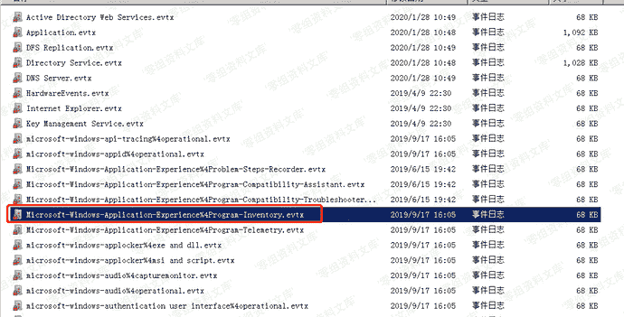
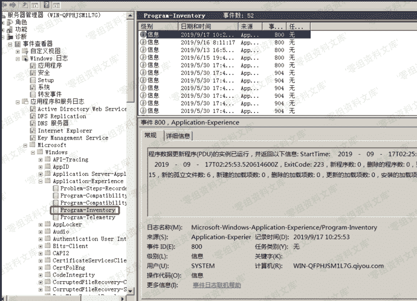
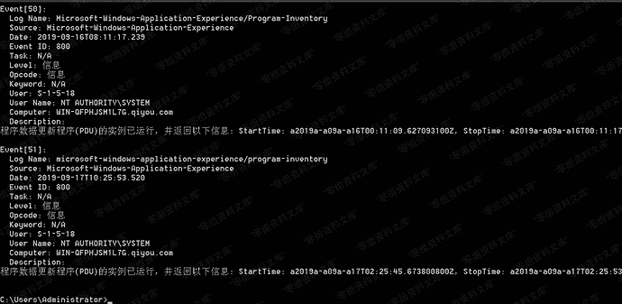

# Program Inventory Event Log

> 原文：[https://www.zhihuifly.com/t/topic/3601](https://www.zhihuifly.com/t/topic/3601)

## Program Inventory Event Log

> `Program Inventory`win7及以上存在，主要用于记录软件活动摘要、安装的程序、安装的Internet Explorer加载项、更新的应用程序、已删除的应用程序

文件夹中的位置：`C:\Windows\System32\winevt\Logs\Microsoft-Windows-Application-Experience%4Program-Inventory.evtx`，如图



在Windows事件查看器的位置：`Applications and Services Logs\Microsoft\Application-Experience\Program-Inventory`，如图



日志获取：

```
wevtutil qe /f:text Microsoft-Windows-Application-Experience/Program-Inventory 
```

Envent IDs：

1.  800 (`summary of software activities`)
2.  900 & 901 (`new Internet Explorer add-on`)
3.  903 & 904 (`new application installation`)
4.  905 (`updated application`)
5.  907 & 908 (`removed application`)

