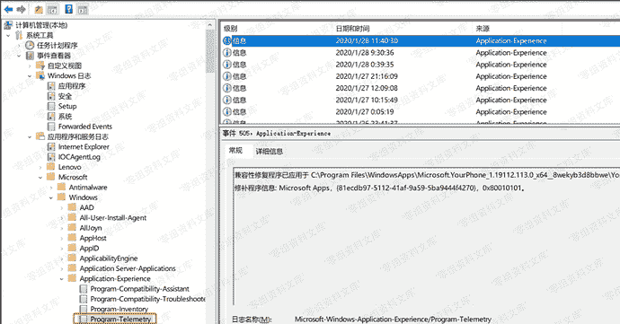
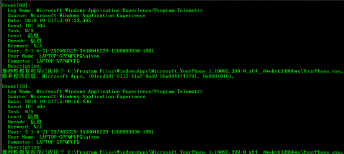

# Program-Telemetry Event Log

> 原文：[https://www.zhihuifly.com/t/topic/3602](https://www.zhihuifly.com/t/topic/3602)

## Program-Telemetry Event Log

> win7及以上存在，在应用程序启动时为应用程序处理应用程序兼容性缓存请求

文件夹中的位置：`C:\Windows\System32\winevt\Logs\Microsoft-Windows-Application-Experience%4Program-Telemetry.evtx`


在Windows事件查看器的位置：`Applications and Services Logs\Microsoft\Application-Experience\Program-Telemetry`，如图



日志获取：

```
wevtutil qe /f:text Microsoft-Windows-Application-Experience/Program-Telemetry 
```

Event IDs：500/505

