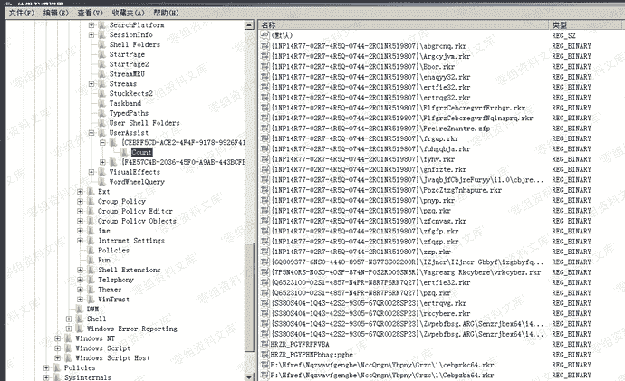
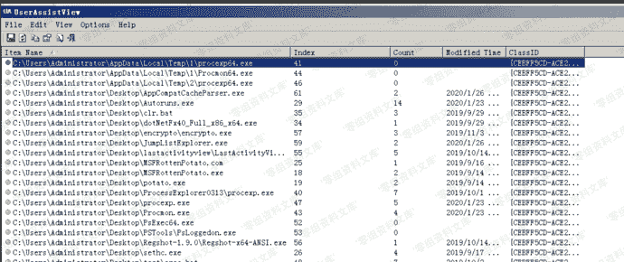
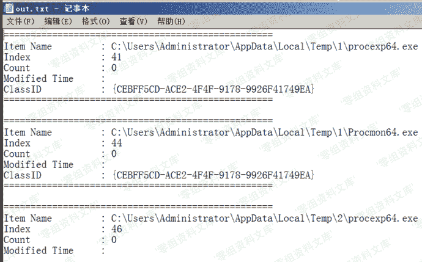

# UserAssist

> 原文：[https://www.zhihuifly.com/t/topic/3605](https://www.zhihuifly.com/t/topic/3605)

## UserAssist

> 跟踪在资源管理器中打开的可执行文件和完整路径，其中UserAssist保存了windows执行的程序的运行次数和上次执行日期和时间。

注册表位置：

**注**：记录实时更新，数据rot-13加密

```
当前用户：
HKEY_CURRENT_USER\Software\Microsoft\Windows\CurrentVersion\Explorer\UserAssist `所有用户：

HKEY_USERS&lt;sid>\Software\Microsoft\Windows\CurrentVersion\Explorer\UserAssist

`` 
```



解析工具：https://www.nirsoft.net/utils/userassist_view.html

图形化界面



命令行使用

```
UserAssistView.exe  /stext out.txt //保存文本格式
UserAssistView.exe  /shtml out.txt //保存html格式
UserAssistView.exe  /sxml out.txt  //保存xml格式 
```

