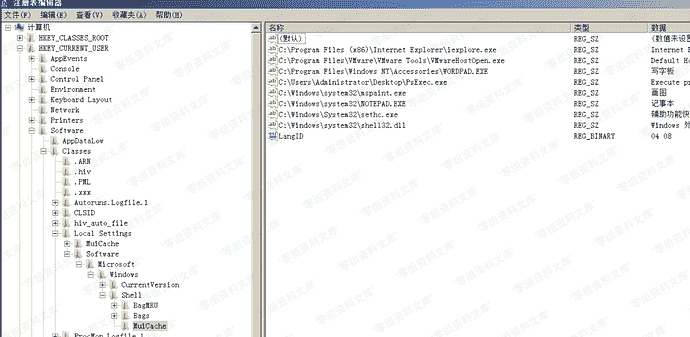
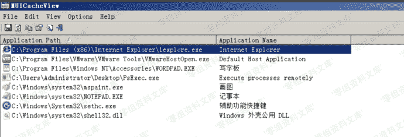
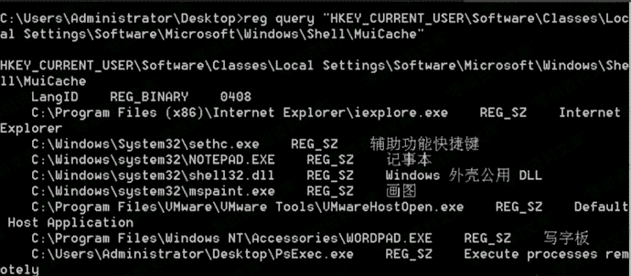

# MUICache

> 原文：[https://www.zhihuifly.com/t/topic/3606](https://www.zhihuifly.com/t/topic/3606)

## MUICache

> 每次开始使用新的应用程序时，Windows都会自动从exe文件的版本资源中提取应用程序名，并将其存储在名为`MuiCache`的注册表项中，供以后使用。

**注**：无加密，记录实时更新

注册表位置：
windows server 2003及以前的

```
当前用户：
HKEY_CURRENT_USER/Software/Microsoft/Windows/ShellNoRoam/MUICache `所有用户：

HKEY_USERS&lt;sid>\Software\Classes\Local Settings\Software\Microsoft\Windows\Shell\MuiCache` 
```

windows server 2003及以后的

```
当前用户：
HKEY_CURRENT_USER\Software\Classes\Local Settings\Software\Microsoft\Windows\Shell\MuiCache `所有用户：

HKEY_USERS&lt;sid>\Software\Classes\Local Settings\Software\Microsoft\Windows\Shell\MuiCache` 
```



图形化界面：

解析工具：http://www.nirsoft.net/utils/muicache_view.html



命令行使用

```
MUICache.exe  /stext out.txt //保存文本格式
MUICache.exe  /shtml out.txt //保存html格式
MUICache.exe  /sxml out.txt  //保存xml格式 
```

或者命令行直接查询注册表也可以

```
reg query "HKEY_CURRENT_USER\Software\Classes\Local Settings\Software\Microsoft\Windows\Shell\MuiCache" 
```

