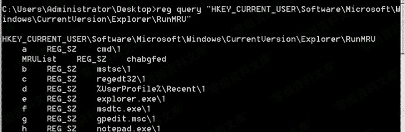

# RunMRU

> 原文：[https://www.zhihuifly.com/t/topic/3607](https://www.zhihuifly.com/t/topic/3607)

## RunMRU

> 保存Win+R启动程序的历史记录

注册表位置：

**注**：数据无加密，记录实时更新

```
当前用户：
HKEY_CURRENT_USER\Software\Microsoft\Windows\CurrentVersion\Explorer\RunMRU `所有用户：

HKEY_USERS&lt;sid>\Software\Microsoft\Windows\CurrentVersion\Explorer\RunMRU` 
```

命令行查询注册表

```
reg query "HKEY_CURRENT_USER\Software\Microsoft\Windows\CurrentVersion\Explorer\RunMRU" 
```

