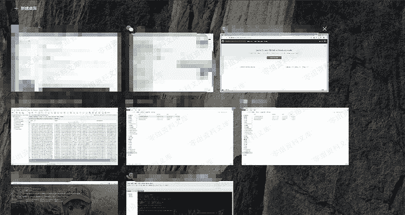
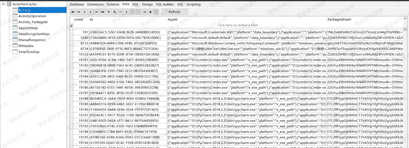

# win10时间轴

> 原文：[https://www.zhihuifly.com/t/topic/3619](https://www.zhihuifly.com/t/topic/3619)

## win10时间轴

> `Windows Timeline`是Windows10在1803版中引入的一个新特性

用户可以使用`Win` + `Tab`可以对其进行访问，时间轴就像浏览器的历史记录一样，它记录了包含您访问过的网站，还包含您编辑的文档，您玩过的游戏，您查看或创建的图像等，其保存的记录在`ActivitiesCache.db`之中



`ActivitiesCache.db`位置在

**注**：无加密，数据实时更新

```
C:\Users\<username>\AppData\Local\ConnectedDevicesPlatform\<random_char>\ActivitiesCache.db 
```

本质是`sqlite3`数据库文件，它包含的表如下

其中最重要的一个表是`Activity`，`Activity`表包含的字段有`AppId`（包含应用程序的路径），开始时间，结束时间等等

