# Windows 端微信取证

> 原文：[https://www.zhihuifly.com/t/topic/3621](https://www.zhihuifly.com/t/topic/3621)

# Windows 端微信取证

*   1，获取聊天记录数据库文件

> 一般在C:\Users\Administrator\Documents\WeChat Files********\Msg
> **********为微信id

> MicroMsg.db就是聊天记录文件

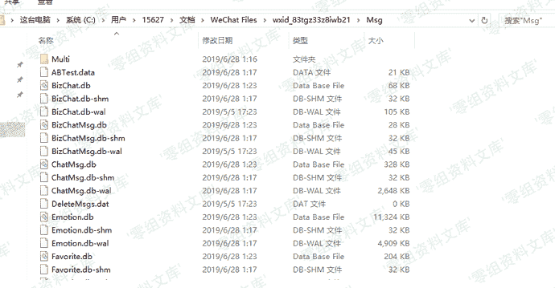

*   2，从内存中读取密钥

> 打开OllyDBG然后打开微信，使用OllyDBG附加微信登录进程

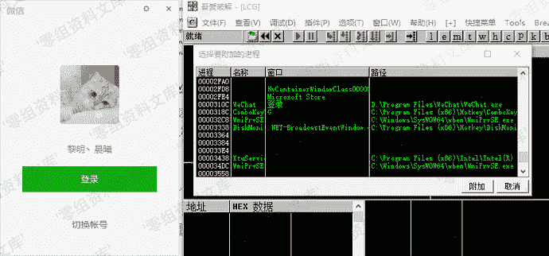

> 在菜单中选择可执行模块

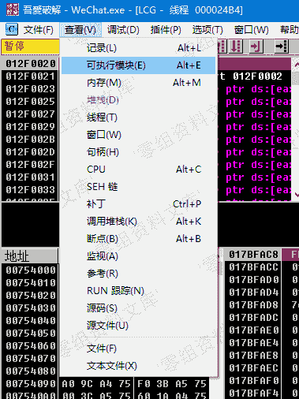

> 从中找到wechatwin模块

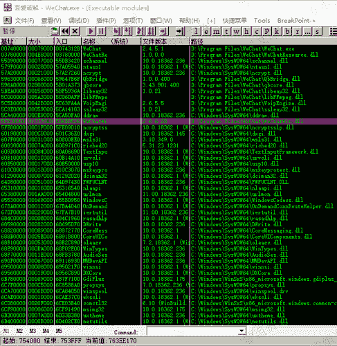

> 在插件中选择搜索ASCII

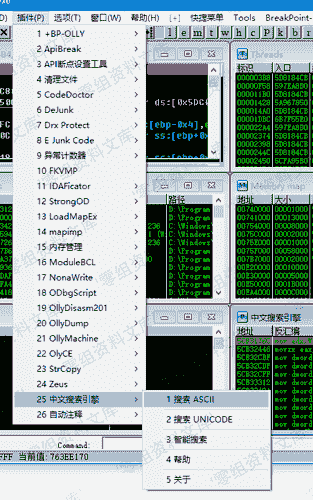

> 在中文字符串里面查找DBFactory::encryptDB

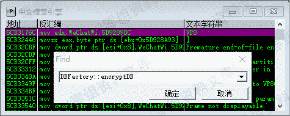

> 查找到后选择

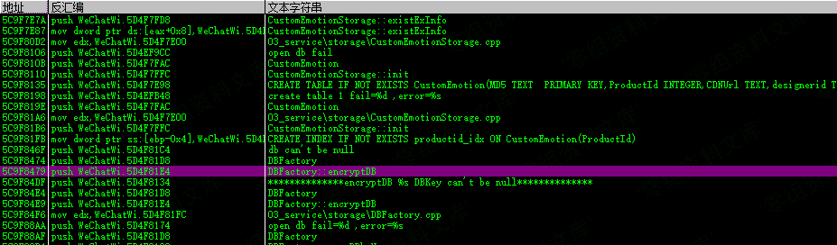

> 双击进去，会定位到所在位置

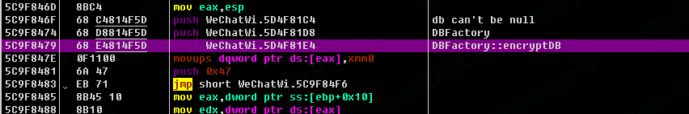

> 向下查找TEST EDX,EDX，就是用来对比密码的汇编语言

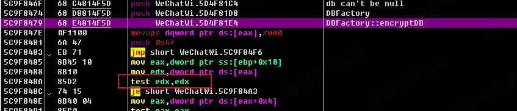

> 双击设置断点，会被标红

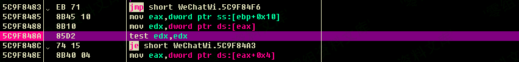

> 然后运行，并登录微信，等待寄存器里edx的值不全为0

> 右键edx数据，选择数据窗口跟随

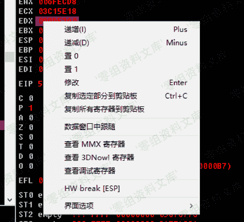

> 跟随后的数据前32位就是密钥

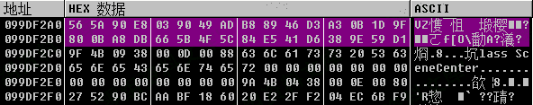

> 即56 5A 90 E8 03 90 49 AD B8 89 46 D3 A3 0B 1D 9F 80 0B A8 DB 66 5B 4F 5C 84 E5 41 D6 38 9E 59 D1

*   3，使用vs编译程序进行解密

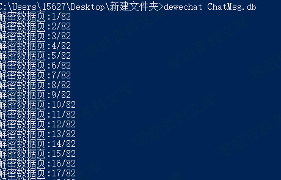

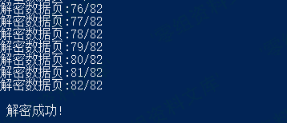

*   4，读取数据

> 使用sqlcipher直接读取数据

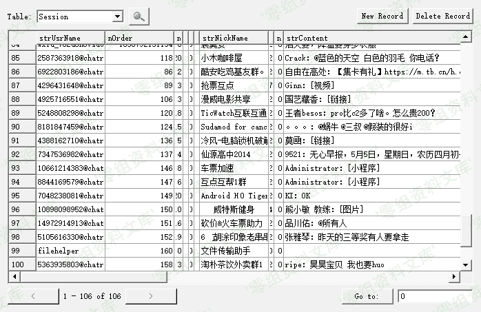