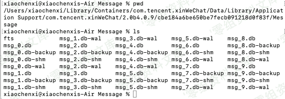
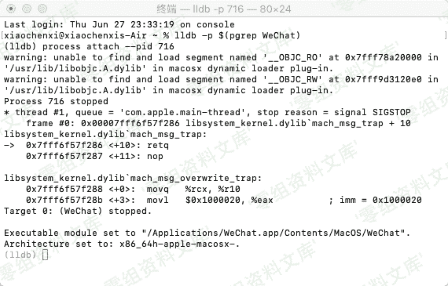
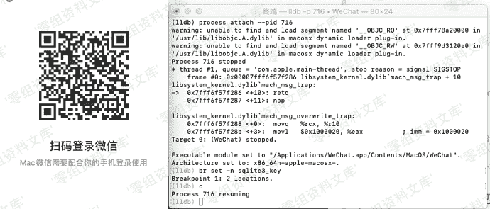
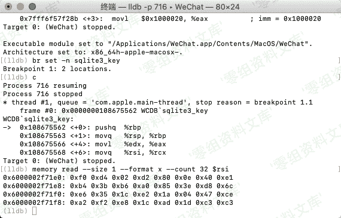
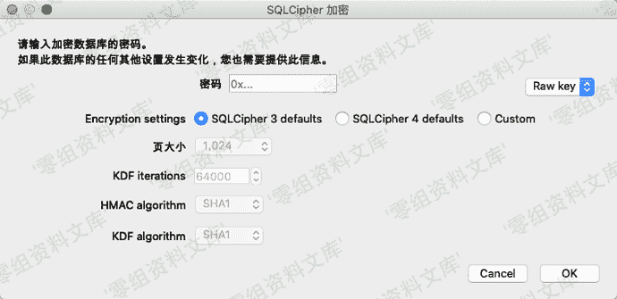
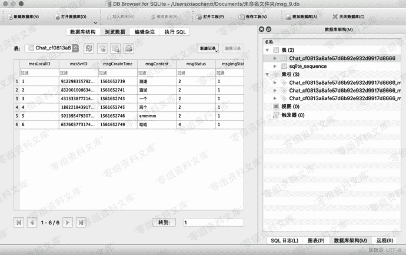

# MAC OS 端微信取证

> 原文：[https://www.zhihuifly.com/t/topic/3623](https://www.zhihuifly.com/t/topic/3623)

# MAC OS 端微信取证

*   1，找到微信数据库文件

```
~/Library/Containers/com.tencent.xinWeChat/Data/Library/Application\ Support/com.tencent.xinWeChat/*/*/Message/*.db 
```



*   2，从内存中读取密钥

> 打开Mac版微信

> 在终端下下输入 lldb -p $(pgrep WeChat) 进入 lldb 的子shell界面（LLDB是mac下的调试工具）



> 再输入br set -n sqlite3_key和c



> 此时登录微信，可能会卡死，但是不影响操作

> 然后在终端输入memory read --size 1 --format x --count 32 $rsi 获取密钥



> 处理多余文本

```
f0d402d2800e40e1
b43bb6a0853ed86c
e6351ce21a0447ce
a2f2e81cad1dc3c3 
```

> 这个64位的字符串就是密钥

*   3，读取数据

> 因为微信使用的是sqlite数据库，这里我们使用 DB Browser for SQLite MAC版进行读取



> 选择SQLCipher 3 defaults 密码类型选择为raw key 在密码框输入0x后再输入之前的密钥共64位进行解密



> 成功获取到聊天记录