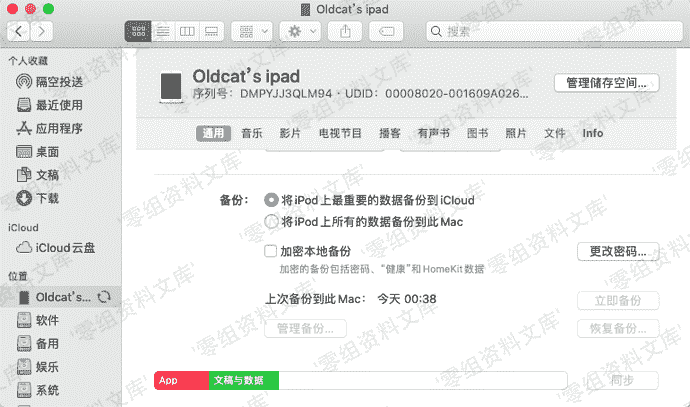
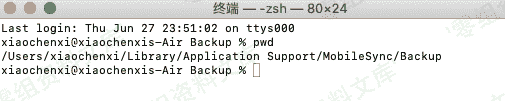
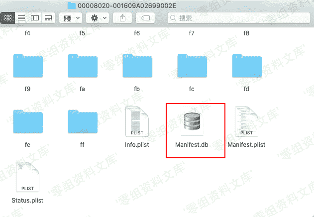
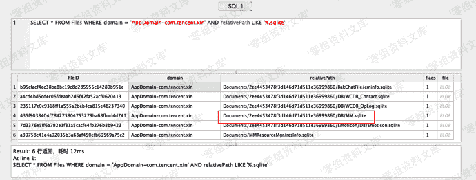
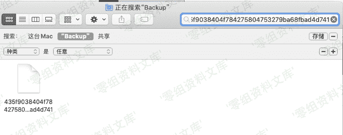
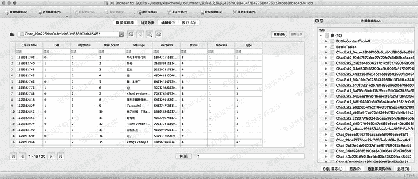

# IOS 端微信取证

> 原文：[https://www.zhihuifly.com/t/topic/3624](https://www.zhihuifly.com/t/topic/3624)

# IOS 端微信取证

*   1，通过备份获取数据库文件

> 使用iTunes备份整机数据



> 在文件夹中查找备份文件

> 文件路径在隐藏文件下，所以先显示隐藏文件 Command + Shift + .

> 路径为

```
/Users/username/资源库/Application Support/MobileSync/Backup/ 
```



在文件夹里查找Manifest.db



> Manifest.db里面记录了各个 app 备份文件的存放状况，但数据太多，这里用sql语句查询下



> MM.sqlite就是微信的主要数据库

> 用fileID搜索文件



> 将文件复制出来，并把后缀改为db

*   2，读取数据

> 因为iOS微信数据库未加密，这里我们使用 DB Browser for SQLite MAC版直接读取



> 成功读到微信聊天记录