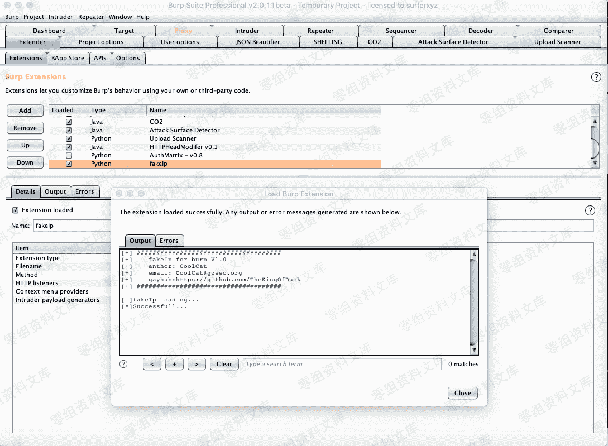
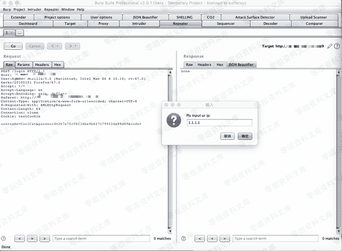
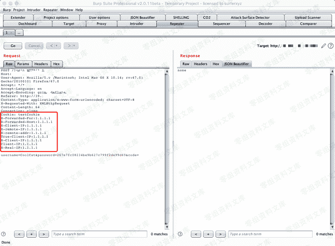
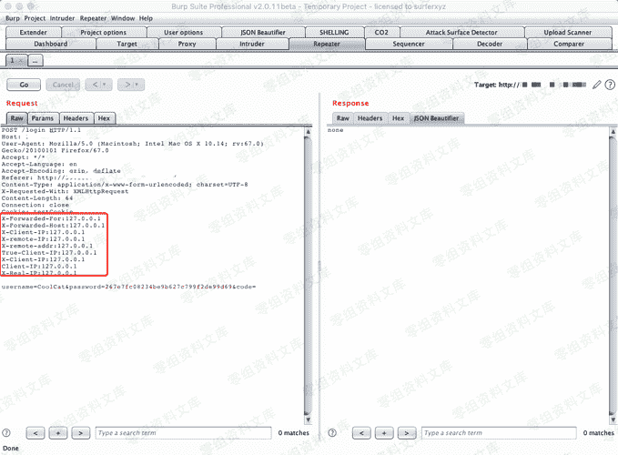
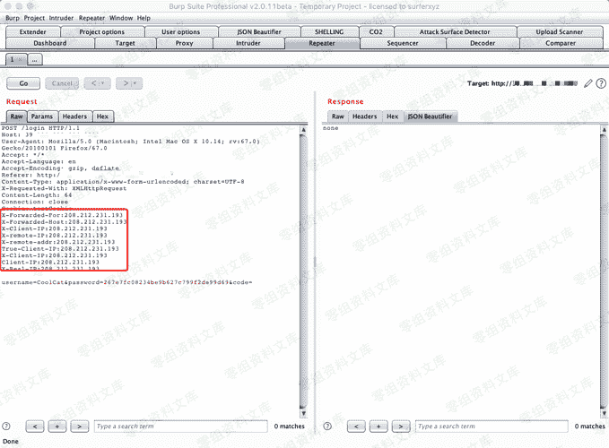
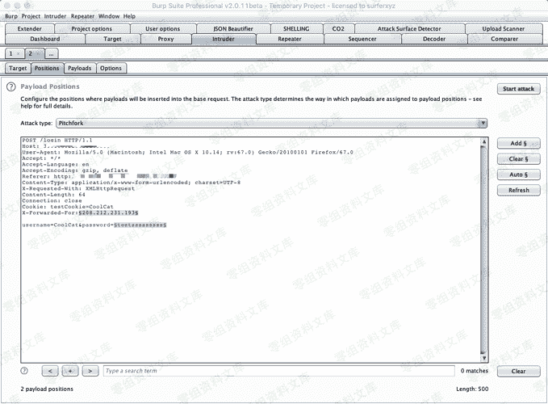
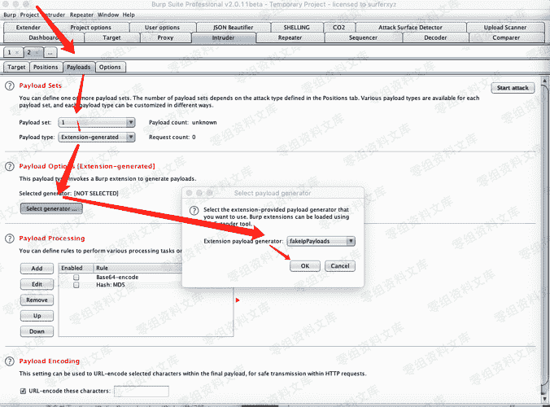
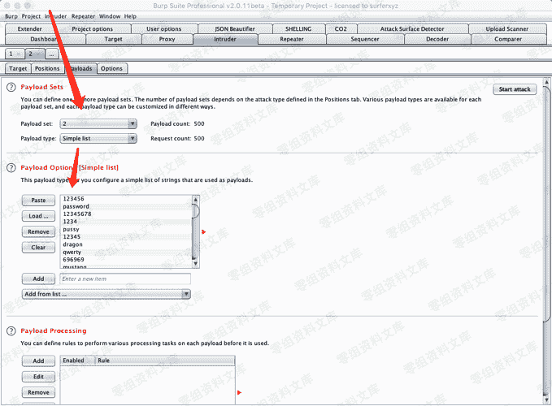
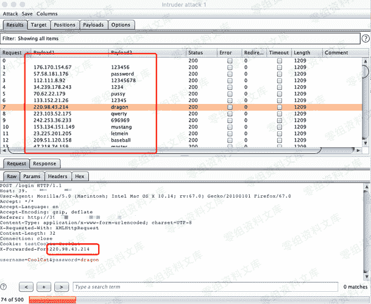

# Burpsuite 伪造ip爆破脚本

> 原文：[https://www.zhihuifly.com/t/topic/3637](https://www.zhihuifly.com/t/topic/3637)

# Burpsuit 伪造ip爆破脚本

https://github.com/ianxtianxt/burpsuiefakeip

## BurpFakeIP



四个小功能

```
伪造指定ip
伪造本地ip
伪造随机ip
随机ip爆破 
```

### 0x01 伪造指定ip

在Repeater模块右键选择fakeIp菜单,然后点击inputIP功能,然后输入指定的ip





程序会自动添加所有可伪造得字段到请求头中。

### 0x02 伪造本地ip

在Repeater模块右键选择fakeIp菜单,然后点击127.0.0.1功能：



### 0x03 伪造随机ip

在Repeater模块右键选择fakeIp菜单,然后点击randomIP功能：



### 0x04 随机ip爆破

伪造随机ip爆破是本插件最核心的功能。

将数据包发送到Intruder模块,在Positions中切换Attack type为Pitchfork模式,选择好有效的伪造字段,以及需要爆破的字段:



按照箭头顺序将Payload来源设置为Extensin-generated,并设置负载伪fakeIpPayloads,然后设置第二个变量。





点击Start attack开始爆破.



如上图,实现每次爆破都使用不同的伪ip进行,避免被ban。

> PS：伪造随机ip爆破的先决条件可以伪造ip绕过服务器限制。