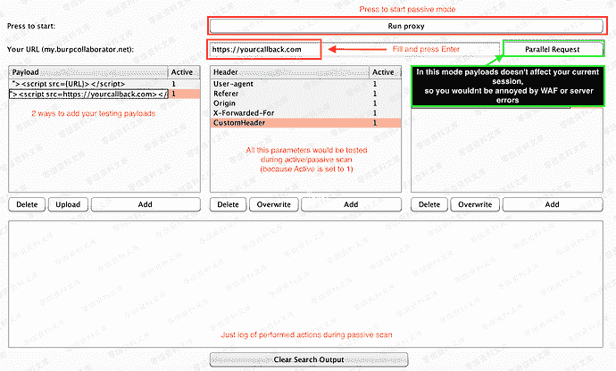

# Burpsuite 自动化blind-xss插件

> 原文：[https://www.zhihuifly.com/t/topic/3638](https://www.zhihuifly.com/t/topic/3638)

# Burpsuite 自动化blind-xss插件

https://github.com/ianxtianxt/Automated-blind-xss-search-for-Burp-Suite

## 安装

Git clone https://github.com/ianxtianxt/Automated-blind-xss-search-for-Burp-Suite.git

Burp -> Extender -> Add -> find and select blind-xss.py

## 如何使用

首先，在名为“Your URL”的字段中设置回调URL，然后按Enter将其自动保存在config.py文件中。

设置好之后，您需要用OOB-XSS向量填充Payloads表，以便扩展程序能够将您的Payloads注入到传出的请求中。请注意，您需要在Payloads中设置{URL}别名，因此扩展名将能够从“Your url”字段中获取数据并将其直接设置为Payloads。

Femida是随机驱动的扩展，因此在主动或被动扫描期间，将在行“Active”中使用带有“ 1”的每个Payloads。因此，如果要从测试中排除任何Payloads或参数/标头，只需将“Active”值更改为0。

## Payloads

*   使用'上传'或'添加'按钮将Payloads添加到表中。
*   不要忘记有效载荷中的{URL}参数。
*   当您将任何数据添加到表中时，活动行将手动等于1.（现在表示其活动状态）
*   如果要使其不活动-将活动行设置为0

## Headers & Parameters

*   您可以使用添加按钮或在 Target/Proxy/Repeater 中单击鼠标右键手动添加数据。

*   headers 和 parameters 不区分大小写。
*   如果要使其不活动-将活动行设置为0。