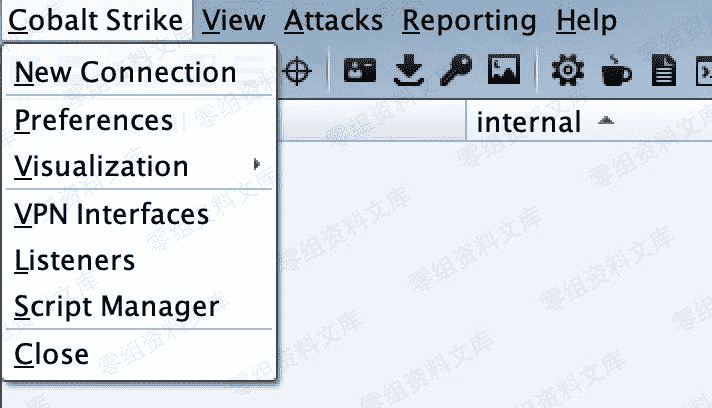
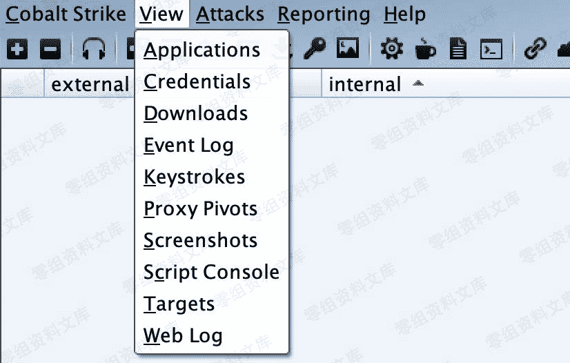
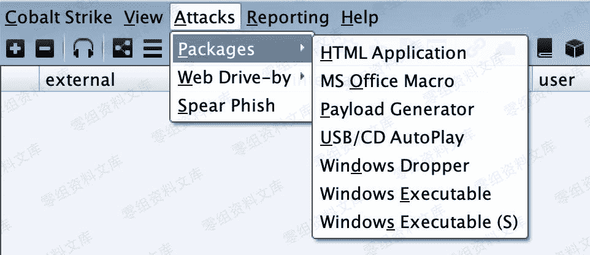
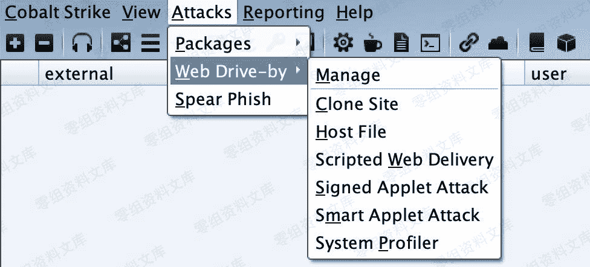
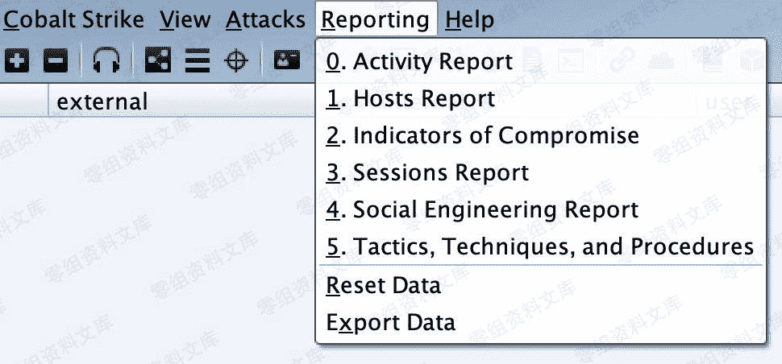
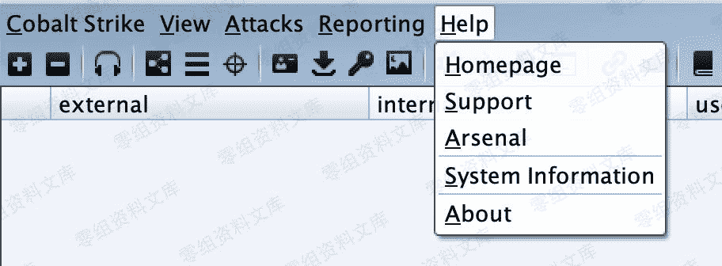
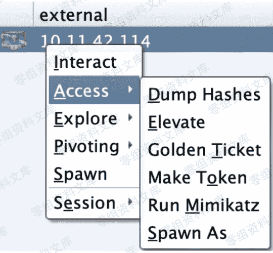
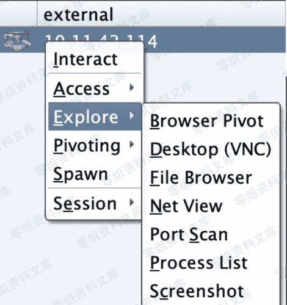
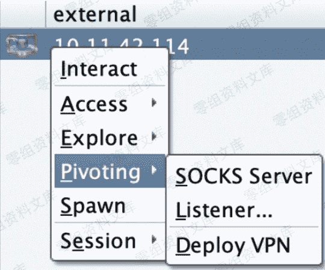
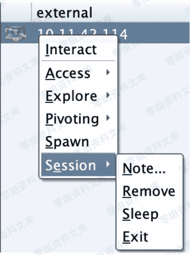

# Cobalt Strike 参数翻译

> 原文：[https://www.zhihuifly.com/t/topic/3640](https://www.zhihuifly.com/t/topic/3640)

# Cobalt Strike 参数翻译

## 主界面参数

### Cobalt Strike



```
New Connection #新的连接(支持连接多个服务器端)

Preferences #偏好设置(设置Cobal Strike界面、控制台、以及输出报告样式、TeamServer连接记录等)

Visualization #窗口视图模式(展示输出结果的形式)

VPN Interfaces #VPN接入

Listenrs #监听器(创建Listener)

Script Manager #脚本管理 `Close #关闭` 
```

### View



```
Applications #应用(显示受害者机器的应用信息)

Credentials #凭证(通过hashdump或Mimikatz抓取过的密码都会储存在这里)

Downloads #下载文件

Event Log #事件日志(主机上线记录以及团队协作聊天记录)

Keystrokes #键盘记录

Proxy Pivots #代理模块

Screenshots #截图

Script Console #脚本控制台(可以加载各种脚本，增强功能https://github.com/rsmudge/cortana-scripts)

Targets #显示目标主机 `Web Log #Web日志` 
```

### Attacks

#### Packages



```
HTML Application #生成恶意的HTA木马文件

MS Office Macro #生成office宏病毒文件

Payload Generator #生成各种语言版本的payload

USB/CD AutoPlay #生成利用自动播放运行的木马文件

Windows Dropper #捆绑器，能够对文档类进行捆绑

Windows Executable #生成可执行Payload `Windows Executable(S) #把包含payload,Stageless生成可执行文件(包含多数功能)` 
```

#### Web Drive-by



```
Manage #对开启的web服务进行管理

Clone Site #克隆网站(可记录受害者提交的数据)

Host File #提供Web以供下载某文件

Scripted Web Delivery #提供Web服务，便于下载和执行PowerShell Payload，类似于Metasploit的web_delivery

Signed Applet Attack #启动一个Web服务以提供自签名Java Applet的运行环境

Smart Applet Attack #自动检测Java版本并利用已知的exploits绕过security `System Profiler #用来获取一些系统信息，比如系统版本，Flash版本，浏览器版本等` 
```

### Reporting



```
0\. Activity report #活动报告

1.  Hosts report #主机报告

2.  Indicators of Compromise #威胁报告

3.  Sessions report #会话报告

4.  Social engineering report #社会工程学报告

5.  Tactics, Techniques, and Procedures #策略、技巧和程序

Reset Data #重置数据 `Export Data #导出数据` 
```

### Help



```
Homepage #官方主页

Support #技术支持

Arsenal #开发者

System information #版本信息 `About #关于` 
```

## 右键菜单参数

### Access



```
Dump Hashes #获取hash

Elevate #提权

Golden Ticket #生成黄金票据注入当前会话

Make token #凭证转换

Run Mimikatz #运行 Mimikatz `Spawn As #用其他用户生成Cobalt Strike侦听器` 
```

### Explore



```
Browser Pivot #劫持目标浏览器进程

Desktop(VNC) #桌面交互

File Browser #文件浏览器

Net View #命令Net View

Port Scan #端口扫描

Process List #进程列表 `Screenshot #截图` 
```

### Pivoting



```
SOCKS Server #代理服务

Listener #反向端口转发 `Deploy VPN #部署VPN` 
```

### Spawn

外部监听器(如指派给MSF，获取meterpreter权限)

### Session



```
Note #备注

Remove #删除

Sleep #指定被控端休眠时间，默认60秒一次回传，让被控端每10秒来下载一次任务。实际中频率不宜过快,容易被发现。 `Exit #退出` 
```