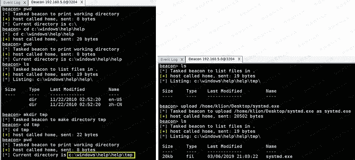
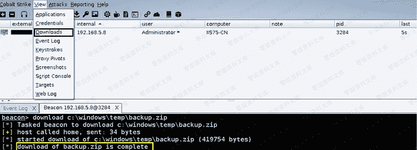
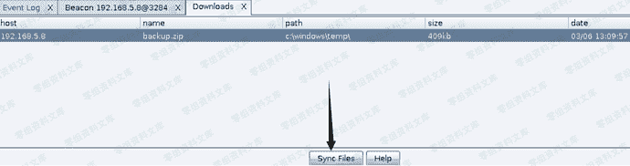
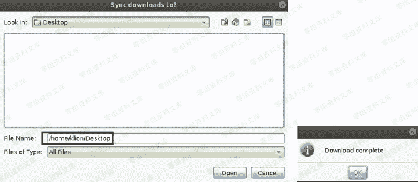
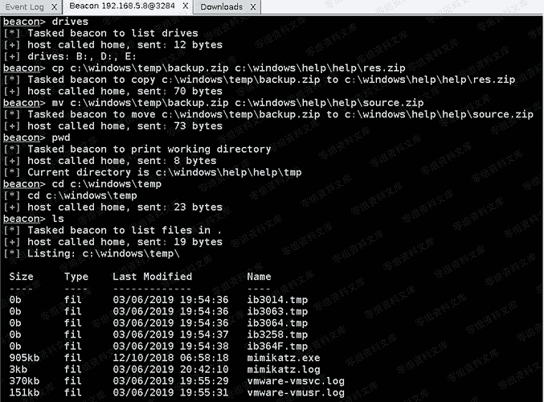

# Cobalt Strike Beacon 基础文件管理

> 原文：[https://www.zhihuifly.com/t/topic/3642](https://www.zhihuifly.com/t/topic/3642)

# Cobalt Strike Beacon 基础文件管理

```
pwd `查看当前所在路径` 
```

```
cd c:\windows\help\help 

切换到指定路径下 
```

```
ls 

查看当前目录下的所有文件和目录 
```

```
mkdir tmp 

在当前目录下新建一个名为 tmp 的目录 
```

```
rm tmp 

删除当前目录下的 tmp 目录,注意,删除指定目录时,不能有进程占用该目录,否则是删不掉的 
```

```
upload /home/klion/Desktop/systmd.exe 

上传 systmd.exe 到当前目录下,貌似只能上传单个文件,其实,平时也压根用不着一次性上传很多东西 
```



```
download c:\windows\temp\backup.zip `下载目标系统中指定路径下的指定文件,此处要特别注意,它并不是直接就下到你本地机器上的,而是先上传到团队服务器,之后需要我们再从团队服务器选中指定文件然后再同步到你本地的` 
```

```
downloads

用于查看当前正在往本地同步的文件,没啥用 
```



> 看到上面提示下载完成之后,点击菜单中的选中要同步的"view" -> "Download"然后再选中你要下载的文件,点击"Sync Files"



> 指明你要保存到的本地路径,即可开始下载,全部下载完成后它依然会提示你,非常简单就不多废话了



```
drives `列出当前系统中的所有盘符` 
```

```
# cp c:\windows\temp\backup.zip c:\windows\help\help\res.zip

复制指定的文件到指定路径下,注意后面的目标路径务必要指定保存为的文件名 
```

```
# mv c:\windows\temp\backup.zip c:\windows\help\help\source.zip

移动指定的文件到指定路径下,注意后面的目标路径务必要指定保存为的文件名 
```

