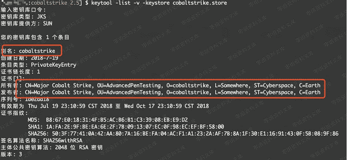

# Cobalt Strike 证书修改

> 原文：[https://www.zhihuifly.com/t/topic/3644](https://www.zhihuifly.com/t/topic/3644)

# Cobalt Strike 证书修改

## 0x01\. Cobalt Strike 简介

> Cobalt Strike是一款渗透测试软件，分为客户端与服务端，服务端是一个，客户端可以有多个，可以进行团队分布式操作，Cobalt Strike集成了端口转发、扫描多模式端口Listener、Windows exe程序生成、Windows dll动态链接库生成、java程序生成、office宏代码生成，包括站点克隆获取浏览器的相关信息等。

> Cobalt Strike 服务端和客户端是通过 SSL 加密通讯的，由于SSL配置文件和代理配置文件由于默认配置导致keystore文件内容通常被用于防火墙识别。

## 0x02\. 查看与修改

### 1.keytool工具介绍

> Keytool是一个Java数据证书的管理工具,Keytool将密钥（key）和证书（certificates）存在一个称为keystore的文件中,即store后缀文件中。

```
[>] $ keytool 
密钥和证书管理工具

命令:

-certreq            生成证书请求

-changealias        更改条目的别名

-delete             删除条目

-exportcert         导出证书

-genkeypair         生成密钥对

-genseckey          生成密钥

-gencert            根据证书请求生成证书

-importcert         导入证书或证书链

-importpass         导入口令

-importkeystore     从其他密钥库导入一个或所有条目

-keypasswd          更改条目的密钥口令

-list               列出密钥库中的条目

-printcert          打印证书内容

-printcertreq       打印证书请求的内容

-printcrl           打印 CRL 文件的内容

-storepasswd        更改密钥库的存储口令 `使用 “keytool -command_name -help” 获取 command_name 的用法` 
```

### 2.store 文件结构

> 在keystore里，包含两种数据：

> 密钥实体（Key entity）—— 密钥（secret key）又或者是私钥和配对公钥（采用非对称加密） 可信任的证书实体（trusted certificate entries）——只包含公钥 。

### 3.store文件创建

```
[>] $ keytool -keystore test.store -storepass 123456 -keypass 123456 -genkey -keyalg RSA -alias baidu.com -dname "CN=(名字与姓氏), OU=(组织单位名称), O=(组织名称), L=(城市或区域名称), ST=(州或省份名称), C=(单位的两字母国家代码)" 
```

> 其中 test.store 为新生成的keystore文件，-alias 指定别名，-storepass pass 和 -keypass pass 指定密钥，-keyalg RSA 指定主体公共密钥算法，-dname 指定所有者信息。

### 4.store文件查看

> 通过keytool工具进行证书文件查看

```
keytool -list -v -keystore "test.store" 
```

### 5.store文件修改

#### 修改证书密码

```
keytool -storepasswd -keystore test.store 
```

> 执行后会提示输入证书的当前密码，和新密码以及重复新密码确认。

#### 修改keystore的alias（别名）

```
keytool -changealias -keystore test.store -alias source_name -destalias new_name 
```

#### 修改alias（别名）的密码

```
keytool -keypasswd -keystore test.store -alias source_name 
```

> source_name是证书中原来的alias（别名），-destalias指定的是要修改为的alias，这里我们改为new_name。

执行后会提示输入keystore密码，alias密码，然后提示输入新的alias密码，即完成修改。

### 6.重新创建 Cobalt Strike 证书文件

#### 查看服务端文件



#### 创建服务端证书文件，请将密码统一

```
keytool -keystore ./cobaltstrike.store -storepass 123456 -keypass 123456 -genkey -keyalg RSA -alias you_name -dname "CN=(名字与姓氏), OU=(组织单位名称), O=(组织名称), L=(城市或区域名称), ST=(州或省份名称), C=(单位的两字母国家代码)"
// 后通过如下命令载入
keytool -importkeystore -srckeystore ./cobaltstrike.store -destkeystore ./cobaltstrike.store -deststoretype pkcs12 
```

> 以上命令请参考服务端启动文件 “teamserver”

#### cobaltstrike.jar 中文件创建

```
keytool -keystore ./ssl.store -storepass 123456 -keypass 123456 -genkey -keyalg RSA -alias you_name -dname "CN=051, OU=SSL-RSA, O=Baidu, L=Beijing, ST=Baidu, C=CN" `keytool -keystore ./proxy.store -storepass 123456 -keypass 123456 -genkey -keyalg RSA -alias you_name -dname “CN=(名字与姓氏), OU=(组织单位名称), O=(组织名称), L=(城市或区域名称), ST=(州或省份名称), C=(单位的两字母国家代码)”` 
```

> 命令中的别名和所有者信息请自行设定。

## 参考链接

> http://absec.cn/?p=683