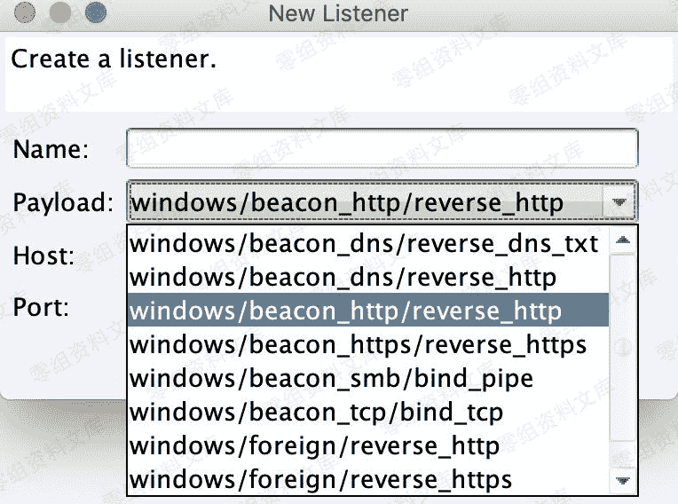
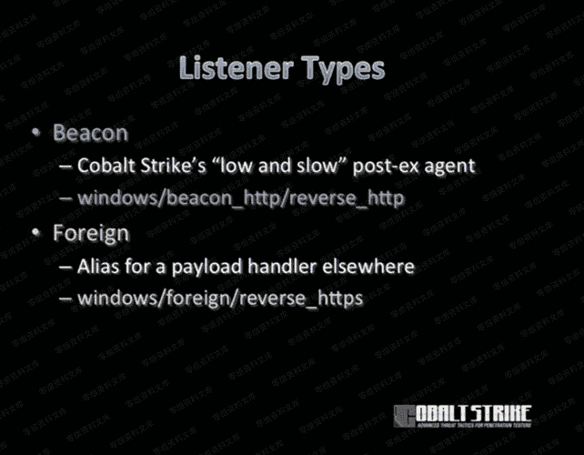

# Cobalt Strike 监听器介绍

> 原文：[https://www.zhihuifly.com/t/topic/3650](https://www.zhihuifly.com/t/topic/3650)

# Cobalt Strike 生成监听器

## Listeners简介

在本版本Cobalt Strike 3.14中，提供了如图9种 Listener (监听器)。



```
windows/beacon_dns/reverse_dns_txt

windows/beacon_dns/reverse_http

windows/beacon_http/reverse_http

windows/beacon_https/reverse_https

windows/beacon_smb/bind_pipe

windows/beacon_tcp/bind_tcp

windows/foreign/reverse_http

windows/foreign/reverse_https `windows/foreign/reverse_tcp (3.13版后增加，支持linuxSSH会话)` 
```



*   beacon_xx 系列为Cobalt Strike自身，包括 dns、http、https、smb 四种方式的监听器。
*   foreign 系列为外部监听器，通常与MSF或者Armitage联动。

在Cobalt Strike 3.13版本后增加了一个新的 Listeners (windows/beacon_tcp/bind_tcp) ，它支持linuxSSH会话。具体更新内容可以查阅